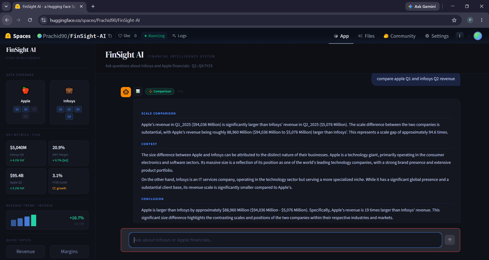
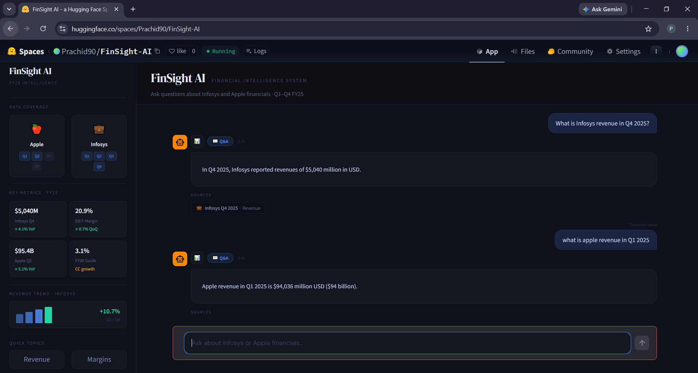

# FinSight AI 📊

> AI-Powered Financial Intelligence System using Retrieval-Augmented Generation (RAG), ChromaDB, and Large Language Models for analyzing quarterly earnings reports through natural language queries.

## 🚀 Live Demo

🔗 Live Demo: https://huggingface.co/spaces/Prachid90/FinSight-AI

---

## 📌 Overview

FinSight AI is an end-to-end Financial Intelligence System that combines semantic retrieval, vector databases, and Large Language Models (LLMs) to extract actionable insights from quarterly earnings reports and earnings press releases.

The system enables users to ask natural language questions about company performance, revenue trends, growth drivers, and quarterly results. FinSight retrieves relevant financial context using semantic search and generates grounded responses through a Retrieval-Augmented Generation (RAG) pipeline.

### Key Achievements

* Built a Financial Intelligence System using RAG over quarterly earnings reports and press releases.
* Implemented semantic retrieval using ChromaDB and Sentence Transformers.
* Supports Financial Q&A, Comparison, Reasoning, Summarization, and Trend Analysis.
* Developed automated revenue extraction supporting both USD and INR reporting formats.
* Achieved **95.6% evaluation accuracy** on a custom financial benchmark.
* Deployed using Streamlit on Hugging Face Spaces.

---

## 📸 Application Preview

### Company Comparison Analysis



### Financial Question Answering




---

## 🏢 Supported Companies

### Infosys

* Q1 2025
* Q2 2025
* Q3 2025
* Q4 2025

### Apple

* Q1 2025
* Q2 2025

---

## ✨ Features

### Financial Question Answering

Ask questions such as:

* What was Infosys revenue in Q4 2025?
* What is Apple revenue in Q2 2025?
* What was Infosys operating margin in Q3?

### Quarter-to-Quarter Comparison

* Compare quarterly performance
* Compare revenue growth
* Compare financial metrics across periods

### Financial Reasoning

* Explain revenue growth drivers
* Identify causes of increases or declines
* Generate contextual financial insights

### Earnings Summarization

* Summarize quarterly earnings reports
* Highlight key business developments
* Extract important financial metrics

### Revenue Trend Analysis

* Revenue trend visualization
* Quarter-over-quarter growth analysis
* USD and INR revenue extraction
* Automated trend insights

### Interactive Dashboard

* Streamlit-based user interface
* Financial charts and visualizations
* Company and quarter selection

---

## 🏗️ System Architecture

```
Financial Reports & Press Releases (PDFs)

↓

PDF Extraction (PyMuPDF)

↓

Document Chunking

↓

Sentence Transformer Embeddings

↓

ChromaDB Vector Store

↓

Semantic Retrieval & Ranking

↓

Query Classification

(Q&A / Comparison / Reasoning / Summary / Trend)

↓

Groq LLaMA 3.1

↓

Financial Insights & Answers
```

---

## 🛠️ Tech Stack

### AI & NLP

* Sentence Transformers
* Hugging Face Transformers
* PyTorch
* Groq LLaMA 3.1 8B

### Retrieval-Augmented Generation

* ChromaDB
* LangChain
* Semantic Search
* Vector Retrieval

### Data Processing

* PyMuPDF
* Pandas
* NumPy
* Scikit-Learn

### Frontend

* Streamlit
* Plotly

### Deployment

* Hugging Face Spaces
* Docker

---

## 🎯 Skills Demonstrated

* Retrieval-Augmented Generation (RAG)
* Large Language Models (LLMs)
* Semantic Search
* Vector Databases
* Financial AI
* Natural Language Processing
* Information Retrieval
* Prompt Engineering
* Streamlit Deployment
* ChromaDB
* LangChain
* Financial Trend Analysis

---

## 📊 Evaluation

| Metric                  | Score |
| ----------------------- | ----- |
| Overall Evaluation Accuracy | 95.6% |

**Evaluation Scope**

* Financial Question Answering
* Financial Comparison
* Financial Reasoning
* Earnings Summarization
* Revenue Trend Analysis

---


## 🚀 Installation

### Clone Repository

```bash
git clone https://github.com/Prachee314/FinSight-AI.git
cd FinSight-AI
```

### Create Virtual Environment

```bash
python -m venv venv
```

### Activate Environment

Windows

```bash
venv\Scripts\activate
```

Linux / macOS

```bash
source venv/bin/activate
```

### Install Dependencies

```bash
pip install -r requirements.txt
```

### Configure Environment Variables

Create a `.env` file:

```env
GROQ_API_KEY=your_groq_api_key
```

### Run Application

```bash
streamlit run app.py
```

---

## 📁 Project Structure

```text
FinSight-AI/

├── app.py
├── main.py
├── ingest.py
├── evaluate.py
├── requirements.txt
├── Dockerfile
├── data/
├── chroma_db/
└── src/
    ├── classifier.py
    ├── extract.py
    ├── chunker.py
    ├── embedder.py
    ├── qa.py
    ├── compare.py
    ├── reasoning.py
    ├── summarizer.py
    ├── trend.py
    └── utils.py
```

---

## 🔮 Future Improvements

* Support additional public companies
* Earnings call transcript analysis
* Agentic financial research workflows
* Advanced RAG evaluation using RAGAS
* Financial forecasting and anomaly detection
* Real-time financial data integration

---

## 👩‍💻 Author

**Prachee Dewangan**

M.Tech – Data Science & Artificial Intelligence

IIIT Naya Raipur

LinkedIn:
https://www.linkedin.com/in/prachee-dewangan-3a001b370/

Hugging Face:
https://huggingface.co/Prachid90

GitHub:
https://github.com/Prachee314

---

## 📄 License

This project is intended for educational and research purposes. Financial reports, earnings reports, and associated data belong to their respective organizations.
